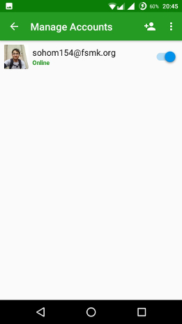
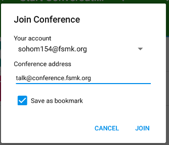

# XMPP

Hi, we at [Free Software Movement Karnataka](https://fsmk.org) have our own XMPP(Jabber) service that we use for all of our internal communication. 
The server software used for hosting the XMPP service is [Prosody](https://prosody.im). 

## Why XMPP?
We decided to use XMPP because it is [free as in freedom software](https://www.fsf.org/about/what-is-free-software), which is in line with the values and principles FSMK stand for. As the saying goes "Practice what you preach!"

## Why host our own server instead of using some existing server?
We decided to set-up and maintain our own server becasue 
- It's way cooler to have your own hostname
- It gives us the flexibility to customise the server as per our own needs.
- It also creates a learning opportunity for our interns and volunteers.

# Features of our service
- It allows anyone to create an account
- We have a Let's Encypt certificate for our host
- secure communication, which includes encryption, and privacy are a priority
- Chats sent from multiple clients syncs on both/all of the devices. 

# Current Admins
- Sohom Bhattacharjee <sohom154@fsmk.org>
- Shijil TV <shijil@fsmk.org>
- Vikram Vincent <vincentvikram@fsmk.org>

### More admin(s) may be added as per request

# Recommended clients
- Conversations (Android)
- Pidgin (Linux) ( this client does not support encryption)
- [Converse.js](https://conversejs.org/) (web client)

## Why use this repo
- This repo will hold all the important and relevant details about our XMPP service
- Users can use the 'issues' page to report bugs and/or request new features
- Details on how to set-up and start using this service will be updated here too.

# Configuring XMPP chat client </u>
___

### __For mobile platform we recommend using [Conversations](https://conversations.im/).__
__Download it from [F-Droid](https://f-droid.org/repository/browse/?fdid=eu.siacs.conversations)__

> __Initial setup for conversations.__

> 1. [Download it](https://f-droid.org/repo/eu.siacs.conversations_165.apk). (Duh!)

> 2. Install it. (Duh! again!)

> 3. From home screen go to Manage Account (Click  from top right menu   ) -> Add New 
Account. Below screen appears. 

> 4. Under Jabber ID  provide desired user name in below format: `<user_name>@fsmk.org` if you do not have an Jabber account or if you wish to use an `fsmk.org` host. 

> 5. Next choose a strong password (in case of new account) or enter the password of your Jabber account.

> 6. Check “Register new account on Server” (If you are creating a new account, else leave it unchecked). Once account has created it appears as shown below.  

> 7. Go back to main screen->Choose Add   option.

> 8. Select Conferences tab and choose  (join). This screen should appear.
>  

> 9. Below popup appears:
 

> 10. Choose your account under `Your Account` and type `talk@conference.fsmk.org` under `Conference address` box.

> 11. Chose join after checking Save as bookmark.

